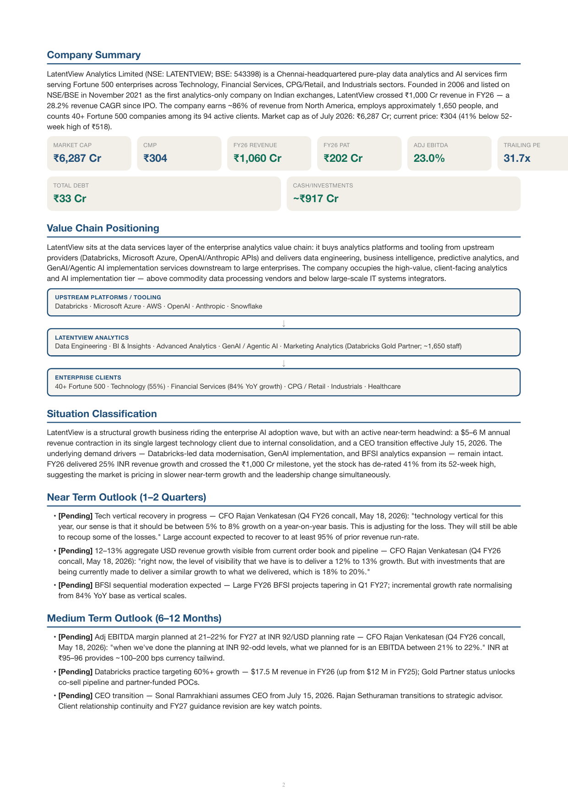
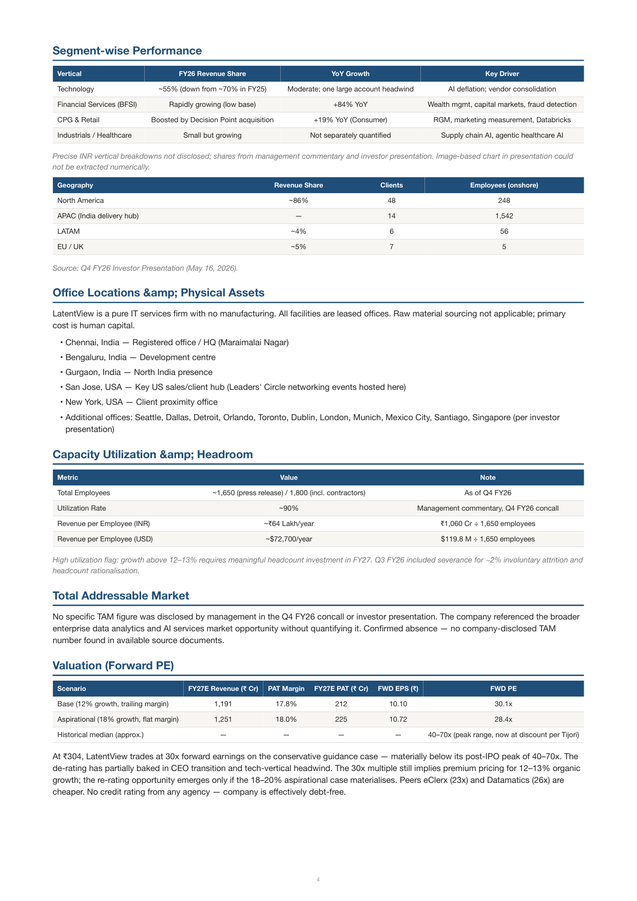
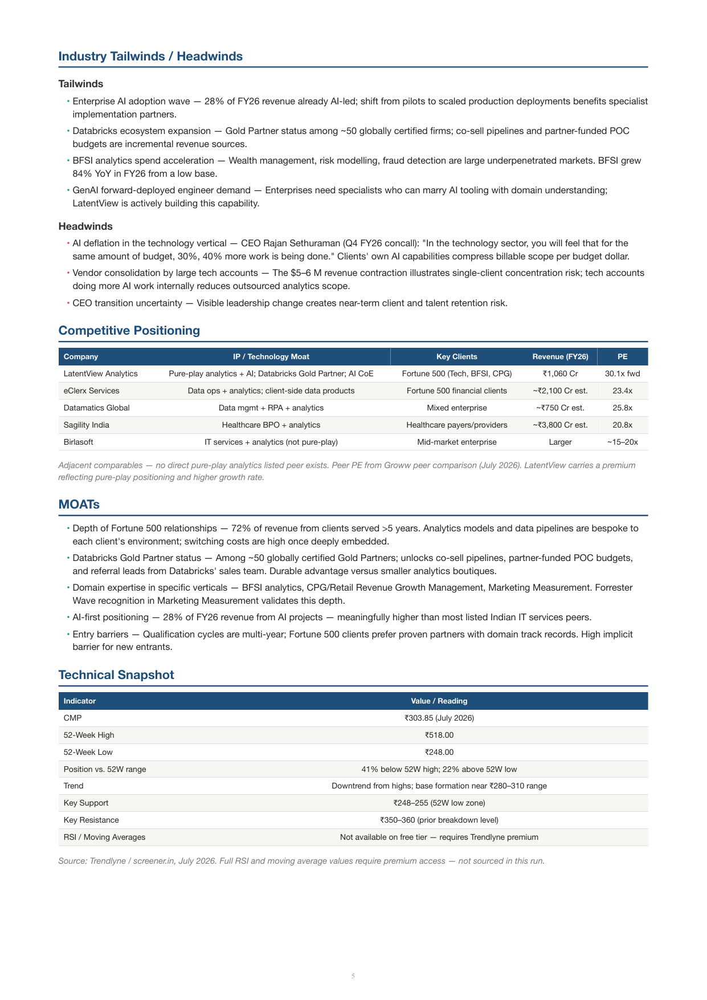

# company-research-skill

A [Claude Skill](https://docs.claude.com/en/docs/agents-and-tools/agent-skills/overview) that turns Claude into an equity-research analyst: point it at a listed company and it produces a **decision-grade** sourced PDF — dense analysis (not headings-only), a fixed 26-section spine, facts-pack ingest, and **one matched sector lens** chosen from ~26 coverage buckets.

**Quality beats token savings** when they conflict. Facts packs avoid dumping whole ARs into context; they are not an excuse to ship a thin report.

---

## Sample output

Four reports generated as validation runs — LatentView Analytics (IT services), Sai Life Sciences (CDMO), Rossell Techsys (aerospace-defence PCB), Supreme Infrastructure (turnaround):

| | |
|---|---|
|  |  |
| *Cover → Company Summary → Value Chain → Situation Classification → Outlook* | *Segment performance tables · Office Locations · TAM · Valuation (Forward PE)* |


*Industry Tailwinds/Headwinds · Competitive Positioning (peer table) · Technical Snapshot*

---

## What it produces

A single PDF (plus markdown source) with a **cover badge** (Structural Growth / Turnaround / Steady Compounder / Cyclical / Structural Decline), then:

- **Company Summary** — headline stat card grid (revenue, margin, market cap, EPS)
- **Value Chain Positioning** — visual flow diagram of where the company sits
- **Situation Classification** — evidenced classification with multi-quarter reasoning
- **Near / Medium / Long Term Outlook** — verbatim sourced quotes + `[Pending]` / `[On Track]` / `[Delivered]` / `[Delayed]` / `[Missed]` status pointers tracked across concalls
- **Marquee & Niche Customers** — named accounts + any disclosed guidance
- **Capex / Milestones / Certifications Timeline**
- **CDMO Pipeline** (when applicable)
- **Financial Performance Summary** — YoY revenue/margin/PBT/PAT table + balance-sheet anomaly check
- **Segment-wise Performance** — always a table, one per disclosed basis/period
- **Order Book** — always a table, as-of date, composition breakdown
- **Manufacturing Locations & Physical Assets** — footprint + raw material sourcing + export/customs data check
- **Capacity Utilization & Headroom** — physical unit table (MW, MT, fiber-km, units/annum), before and after planned capex
- **Total Addressable Market**
- **Valuation** — Forward PE summary table + historical median + evidenced read vs peers/history
- **Industry Tailwinds / Headwinds**
- **Competitive Positioning** — peer comparison table on IP/tech moat, customers, certifications
- **MOATs** — entry barriers, IP, product criticality, switching costs
- **Technical Snapshot** — table (never prose)
- **Promoter / Governance Track Record** — guidance reliability + shareholding trend table + fundraise table + credit-rating actions + litigation
- **Investment Thesis Summary** — evidenced bull case (or honest statement it doesn't hold)
- **Key Risks / Red Flags** — mandatory even in a bullish report
- **Verdict** — one paragraph on confidence level
- **Sources** — numbered, hyperlinked

**Discipline:** a claim without a source and a date is not evidence. A headings-only or thin PDF is a failed run.

---

## Ingest design

Raw concalls, decks, and annual reports are extracted to disk under `~/.company-research/<slug>/sources/`. The agent drafts from JSON **facts packs** in `facts/` — packs must be rich enough for a decision-grade PDF (concall mined, peers filled, confirm/kill written).

| Script | Role |
|--------|------|
| `scripts/freshness.py` | `no_state` / `up_to_date` / `new_quarter` / `force_full` |
| `scripts/pdf_to_text.py` | Full-doc PDF → txt |
| `scripts/query_source.py` | Grep / BM25 snippets only — never loads whole docs |
| `scripts/outlook_candidates.py` | Forward-looking quote candidates from transcript |
| `scripts/build_facts.py` | Init/merge packs + apply sector lens schema |
| `scripts/validate_depth.py` | **Ship gate** — depth + source completeness + prose quality |
| `scripts/scenario_value.py` | Bull/base/bear EPS × multiple math |
| `scripts/assemble_pdf.py` | HTML → WeasyPrint PDF with error recovery |
| `scripts/forward_pe.py` / `capacity_utilization.py` | Deterministic maths helpers |

**Ship only if** `validate_depth.py --slug <slug>` exits 0.

### Prose quality gates (enforced by `validate_depth.py`)

| Check | Threshold |
|-------|-----------|
| Body word count | ≥ 3,500 |
| `<li>` / `<p>` ratio | ≤ 2.5 |
| Average `<p>` word count | ≥ 35 words |
| Analytical paragraphs ≥ 60 words (non-turnaround/cyclical reports) | ≥ 2 |
| Tip-speak banned | "accumulate on dips", "trim above", "avoid chasing" → instant fail |

---

## Sector lenses (~26)

After classifying the company (`references/sector-router.md`), the skill loads **one** folder:

```
skills/company-thesis-report/sectors/<lens-id>/
  LENS.md                 # primer, must-have metrics, valuation method, deep-dive template
  metrics.schema.json     # overlay shape + query keys + peer columns
```

Current lenses: `banks`, `nbfc-hfc`, `aerospace-defence`, `capital-goods-epc`, `it-services`, `specialty-chemicals`, `fmcg-staples`, `renewables`, `pharma-cdmo`, `generic`, …

To add a sector: create a new folder + add a router row — **no spine changes**.

---

## Repository layout

```
company-research-skill/
├── docs/
│   └── assets/               # README preview images
└── skills/
    └── company-thesis-report/
        ├── SKILL.md
        ├── references/
        │   ├── report-format.md
        │   ├── depth-checklist.md
        │   ├── writing-quality.md    # prose gates — research memo, not tips
        │   ├── sector-router.md
        │   ├── source-routing.md
        │   └── facts-schemas.md
        ├── sectors/                  # one lens folder per coverage bucket
        │   ├── it-services/
        │   │   ├── LENS.md
        │   │   └── metrics.schema.json
        │   ├── renewables/
        │   ├── aerospace-defence/
        │   └── …
        ├── scripts/
        │   ├── html_helpers.py       # cover, card_grid, flow_diagram, kpi_table, timeline, flag_list, verdict_box
        │   ├── assemble_pdf.py       # HTML → WeasyPrint PDF (with try/except around write_pdf)
        │   ├── validate_depth.py     # ship gate — source completeness + prose quality
        │   ├── build_facts.py        # init/merge JSON facts packs (all packs include guidance_reliability)
        │   ├── scenario_value.py     # bull/base/bear valuation bands
        │   ├── charts.py
        │   ├── pdf_to_text.py
        │   ├── query_source.py
        │   ├── outlook_candidates.py
        │   ├── freshness.py
        │   ├── forward_pe.py
        │   └── capacity_utilization.py
        ├── requirements.txt
        └── assets/
            └── report_style.css
```

---

## Requirements

- Claude with Agent Skills + code execution / file access
- Python 3:

  ```bash
  pip install -r skills/company-thesis-report/requirements.txt
  ```

- WeasyPrint v60+ (for PDF rendering)

---

## Installation

### Claude Code / Agent SDK

```bash
git clone git@github.com:iamurali/company-research-skill.git
mkdir -p ~/.claude/skills
cp -r company-research-skill/skills/company-thesis-report ~/.claude/skills/
```

Project-scoped:

```bash
mkdir -p .claude/skills
cp -r company-research-skill/skills/company-thesis-report .claude/skills/
```

### Claude / Cowork desktop

```bash
cd company-research-skill/skills
zip -r company-thesis-report.skill company-thesis-report
```

Upload under Settings → Capabilities → Skills.

---

## Usage

Natural language — no slash command needed:

- `"What's the story with <TICKER>?"`
- `"Build me an investment thesis on <Company>."`
- `"Research <Company> — is it a buy?"`
- `"Regenerate <Company>'s report"` — incremental refresh (new quarter only)
- `"Rebuild <Company> from scratch"` — bypass cache, refetch everything

Claude will:

1. Check freshness for `~/.company-research/<slug>/`
2. Classify sector → load one lens from `sectors/<lens-id>/`
3. Ingest sources to disk (concalls + investor decks + annual reports) until `sources_completeness` passes
4. Build JSON facts packs; run `validate_depth.py` (ship gate)
5. Draft the 26-section spine as a **research memo** — tables + analytical paragraphs, not tip lists
6. Assemble PDF only after validate passes (WeasyPrint; falls back to clean error if render fails)
7. Deliver PDF + short spoken summary

### First run vs refresh

| Request phrasing | Behavior |
|-----------------|----------|
| New company | Full ingest + all packs |
| `regenerate` / `refresh` / `update` | `new_quarter` — delta packs only |
| `from scratch` / `rebuild` / `ignore the cache` | `force_full` — refetch everything |
| Same quarter again | `up_to_date` — reuse cached; optional price refresh |

---

## Customizing

| What | Where |
|------|-------|
| Section spine | `references/report-format.md` (keep sector-agnostic) |
| Depth / ship gate | `references/depth-checklist.md` + `scripts/validate_depth.py` |
| Prose quality gates | `references/writing-quality.md` |
| Sector routing / new lens | `references/sector-router.md` + `sectors/<id>/` |
| Visual style | `assets/report_style.css` |
| HTML components | `scripts/html_helpers.py` — `cover`, `card_grid`, `flow_diagram`, `kpi_table`, `timeline`, `flag_list`, `verdict_box` |

---

## License

MIT — see [LICENSE](LICENSE).
